# Garlic Press Documentation

## Table of Contents
- [Introduction](#introduction)
- [Features](#features)
- [Setup](#setup)
- [Usage](#usage)
- [Media Layer Editor](#media-layer-editor)

---

## **Introduction**
GarlicPress is a companion application for the RG35xx running GarlicOS. It streamlines interactions with your device, reducing the need to frequently remove the SD Cards from your RG35xx.

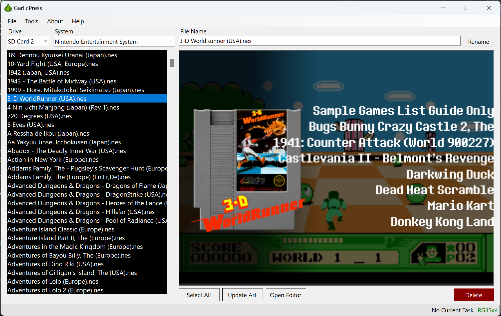

---

## **Features**

- **File Management:** Browse and manage files in the Roms folders across systems and SD Card.
- **Art Scraper:** Fetch game art from screenscraper.fr automatically.
- **Drag-and-Drop:** Transfer files to System Folders with a simple drag and drop.
- **File Operations:** Rename and delete files with ease.
- **Skin Configuration:** Adjust and preview your RG35xx interface.
- **Command Console:** Directly run commands on your RG35xx.
- **Save Backup:** Backup your game save files.

---

## **Setup**

### **Enabling ADB on RG35xx**

1. Remove the main SD card from the RG35xx and put it into your PC.
2. In the 'Misc' partition, create a file named "enableADB" without ".txt" file extension.

#### If you can't see file extensions:

1. Go to 'Options' in your file explorer.
2. In the 'View' tab, uncheck the 'Hide extensions for known file types' option.
3. Remove the '.txt' extension from 'enableADB'.

Finally, put the SD card back into the RG35xx.

### **Alternatively Using the Toggle ADB App**

* "[Toggle ADB](https://www.rg35xx.com/en/apps/mods-for-garlicos/)" can be added to the device Roms/APPS folder for a way on device to enable and disable ADB. This could be a good option for people who need to disable ADB to use external controllers.
* This may already be installed on your device. So check apps in Consoles if you already have it.

---

## **Usage**

### **Connecting to GarlicPress**

1. Connect your RG35xx to your PC using a USB cable.
2. Open GarlicPress. When connected, the app icon will turn green.

### **Viewing ROMs**

Browse various sections like 'DOS games' to see content from your RG35xx.

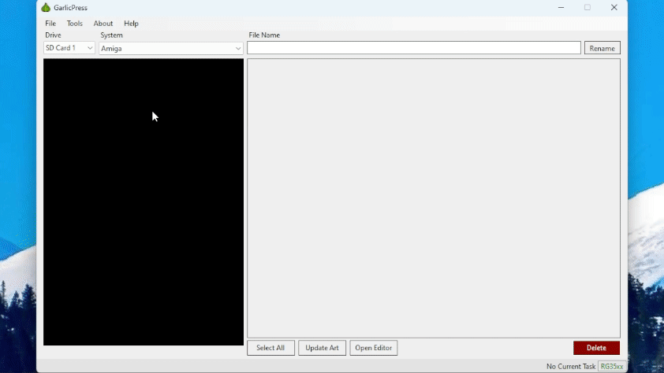

### **Updating Art**

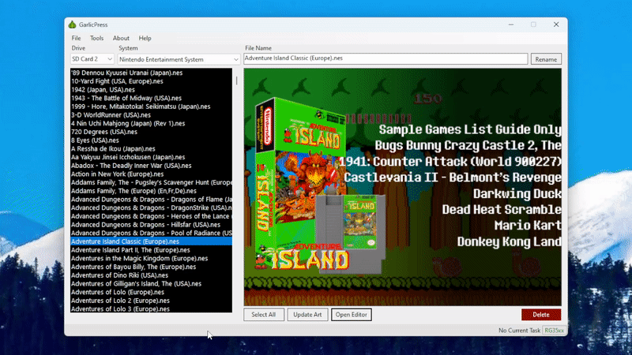

Enhance or change the visual representation of your games with the 'Update Art' function in GarlicPress. To use this feature, follow the steps below:

1. **Initiating the Update Art**:
   - In the main window, click the 'Update Art' button.
   - This action opens the Update Art window which displays games you've previously selected in the main window.

2. **Selecting Multiple Games in the Main Window**:
   - Utilize standard Windows selection methods to select your games:
     - **Individual Selection**: Hold the **Ctrl** key and click on games to select them one by one.
     - **Range Selection**: Hold the **Shift** key and click on a game to highlight all games between your initial selection and your most recent click.

3. **Navigating the Update Art Window**:
   - Within this window, you can:
     - View the Game Art update status for all the selected games.
     - Preview the game art for the most recently updated game.
     - Choose the desired Media Layer Collection from a single dropdown menu. This will apply to all selected games. 
     - Check the Allow only local media update checkbox if you want to force the update of local media even if game is not found on ScreenScraper.fr. It will only update if you have added local media to the Media Layer Collection.
     - Begin the art update process using the **Start Button**.
     - When the update is complete you can check the status of each game. If any game failed to update you can Clear Completed games and try the failed games again by pressing start. 
     - If game media failed to update, you can change the search text for that game and try again.
     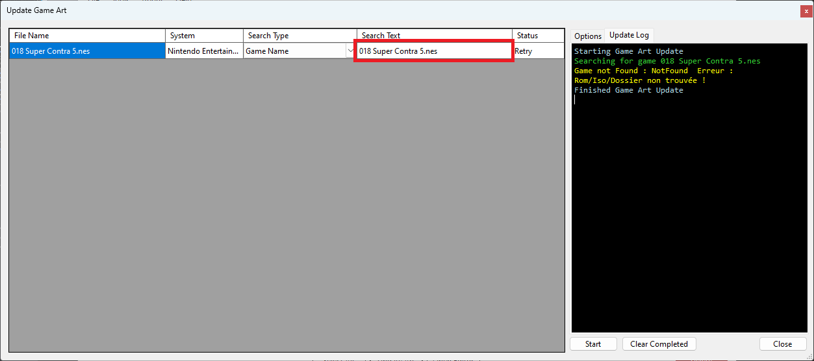

### **ScreenScraper.fr**

1. Create an account on [ScreenScraper.fr](https://www.screenscraper.fr/).
2. Enter your ScreenScraper credentials in GarlicPress's settings, important to use your username and not mail adress.

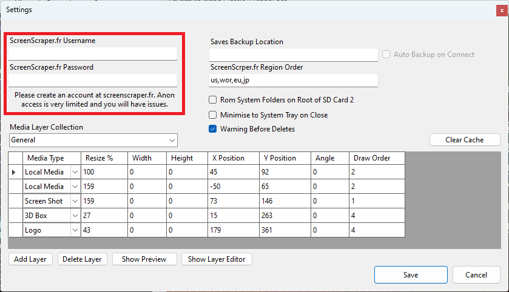

---

## **Media Layer Editor**

### **Introduction**

The Media Layer Editor in GarlicPress makes it easy preview and change game art layouts for GarlicOS.

### **Overview**

With the Media Layer Editor, customize your game visuals within GarlicOS. Create unique game art for each system or collection of games using Media Layer Collections.

### **Features**

1. **Media Layer Collections**:
   - Organize game art into different collections.
   - Each collection consists of list of Media Layers.
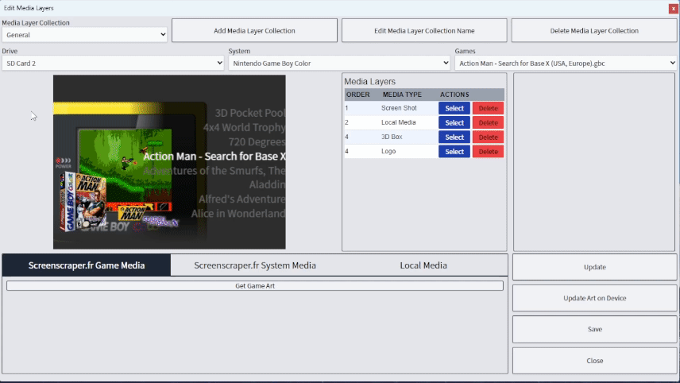

2. **Media Layers**:
   - Use media from ScreenScraper, game art and system art, or local files.
   - Apply transformations like resizing, repositioning, or adding filters.

3. **Filters**:
   - Enhance game visuals with filters like saturation, contrast, and more.

4. **Quick Access from Main Window**:
   - Access the editor instantly from the main window.
   - Preloaded game from the main window for faster editing.

5. **Direct Game Art Update**:
   - Update game art directly from the editor or save it and update multiple games with Update Art window.

### **Usage**

1. **Media Layer Collections**:
   - Start by launching the Media Layer Editor. At the top, you'll find a dropdown box for selecting a Media Layer Collection.
   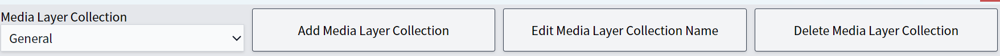
   - To the right of this selection box, there are three buttons to manage your collections:
     1. **Add Media Layer Collection**: Clicking this will open a dialog where you can:
        - Enter a name for your new collection.
        - Decide if you want this collection to be based on an existing one or if you'd prefer to start from scratch.
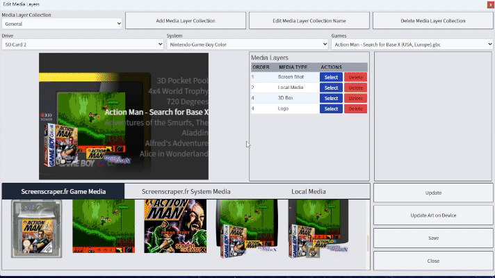
     2. **Edit Media Layer Collection**: Use this to modify the name of an existing collection.
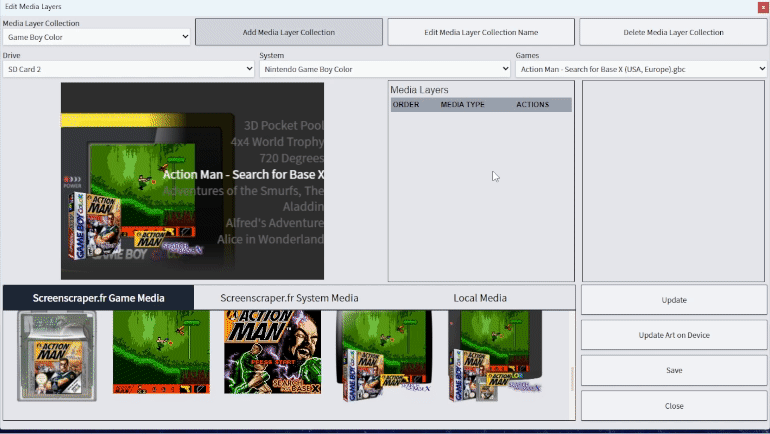
     3. **Delete Media Layer Collection**: This allows you to remove a collection entirely.
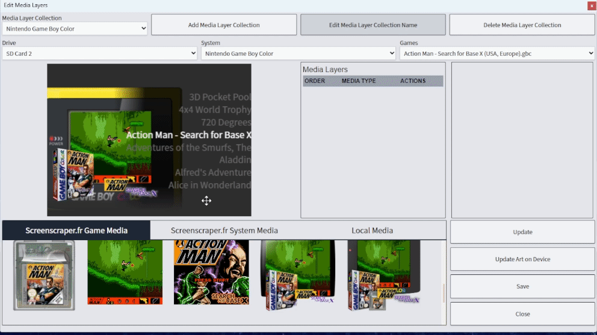

2. **Too add a new Media Layers**:
   - Click on the media you want to add if there's no media loaded click on the Get Game Media/Get System Media buttons.
   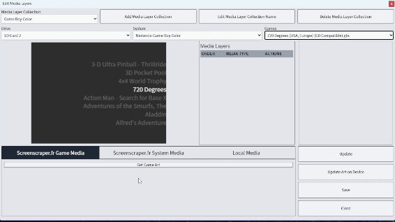
   - Modify size, position, angle, and apply filters.
     1. Select the media layer you want to modify by clicking it in the preview window or by selecting it in Media Layers view.
     2. Transforms :
		- **Position**: Drag the media by click and drag in the preview window. Or by clicking the arrow keys.
        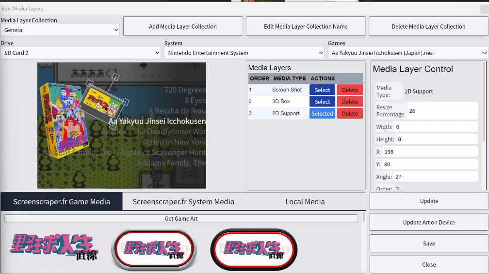
		- **Size**: Drag one of the corners of the media layer in the preview.
        
		- **Angle**: Drag the sqaure thats on top to either direction and it will rotate the media.
        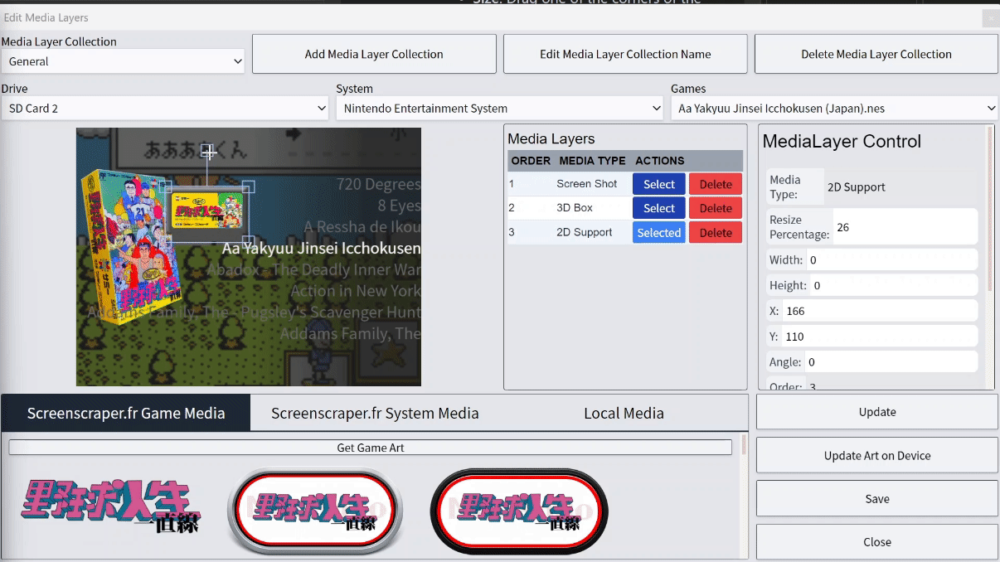
        - **Delete**: Click on the delete button on Media Layers view or by selecting a media layer and pressing the delete key.
        - All of these can also be manupilated from the Media Layer Control View.
        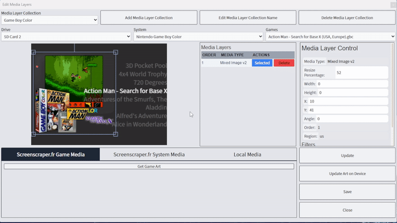
        - **Draw Order**: Change the draw order by clicking Page Up or Page Down.

4. **Filters**:
   - Pick a filter from the dropdown and click 'Add'.
   - Adjust settings until you achieve the desired effect.

5. **Editing from the Main Window**:
   - Click 'Open Editor' for quick access.
   - Use 'Update Game Art' for individual games or 'Update Art' for multiple games in the main window.

6. **Saving Your Edits**:
   - Remember to click 'Save' before closing the editor to keep your changes.